# OmniDesk AI — Enterprise RAG Customer Support Hub

> **Zero-Hallucination AI Customer Service Grounded in Verified Store Policies & Enterprise Knowledge Bases.**
> Powered by **Google Gemini 3.6 Flash**, dense embeddings (`gemini-embedding-001`), **ChromaDB Vector Store**, **FastAPI Backend**, **Support Hub SPA**, and **Streamlit Command Center**.

---

## 🏆 Project Overview & 7-Phase Architecture

OmniDesk AI is an enterprise-grade customer support platform engineered to automate frontline resolutions while strictly adhering to company policies without hallucination.

```mermaid
flowchart TD
    subgraph ClientLayer["Client & Interface Layer"]
        A1["Commercial Landing (index.html)"]
        A2["Support Hub SPA (app.html)"]
        A3["Streamlit Center (app.py)"]
    end

    subgraph SecurityLayer["Security & Gateway (Phase 2)"]
        B1["Sliding-Window Rate Limiter"]
        B2["Admin Key Auth (X-API-Key)"]
        B3["Input Sanitization Guards"]
    end

    subgraph CoreEngine["Core Intelligence & RAG (Phases 1, 4, 6)"]
        C1["Language Detection (7 Languages)"]
        C2["ChromaDB Vector Store (gemini-embedding-001)"]
        C3["Gemini 3.6 Flash Synthesizer"]
        C4["Intent & Sentiment Classifier"]
    end

    subgraph EscalationAndCopilot["Escalations, Copilot & Macros (Phases 3, 5, 6)"]
        D1["Ticket Escalation & CUST-XXXX Routing"]
        D2["AI Copilot Grounded Reply Generator"]
        D3["Message Threading & Internal Staff Notes"]
        D4["Live SLA Urgency Engine"]
        D5["Macro Automation Rules Engine"]
    end

    subgraph OpsAndBenchmarking["Enterprise Operations (Phases 6, 7)"]
        E1["CSAT Telemetry & Dynamic Analytics"]
        E2["Outbound Incident Webhooks (Slack/PagerDuty)"]
        E3["Autonomous Synthetic Benchmark Studio"]
    end

    ClientLayer --> SecurityLayer
    SecurityLayer --> CoreEngine
    CoreEngine --> EscalationAndCopilot
    EscalationAndCopilot --> OpsAndBenchmarking
```



---

## 🌟 Key Capabilities by Phase

### 1. Phase 1: Core Grounded RAG & Real-Time SSE Token Streaming

- **Dense Embedding Search**: Chunks and indexes company policies (`company_faq.txt`) into ChromaDB using 3,072-dim embeddings.
- **Server-Sent Events (SSE)**: Streaming endpoint (`/ask/stream`) delivering sub-second token streams with verified citations.
- **Strict Distance Guardrails**: Deflects out-of-scope/unverified inquiries to human agents.

### 2. Phase 2: Production Hardening & Security

- **Sliding-Window Rate Limiting**: Per-client IP throttling returning `HTTP 429 Too Many Requests` with `Retry-After`.
- **Admin API Key Authorization**: Sensitive management endpoints guarded via `X-API-Key` headers.
- **Input Validation**: Pydantic models enforcing payload size limits and non-empty checks (`422 Unprocessable Entity`).

### 3. Phase 3: Smart Escalation & Customer ID Routing

- **Automated Ticket Creation**: Customer profile assignment (`CUST-XXXX`), VIP tier tracking, and priority triage.
- **Lifecycle Workflows**: Status transitions (`Open` $\to$ `In Progress` $\to$ `Resolved`), agent assignments, and resolution rate analytics.

### 4. Phase 4: Multi-Channel Intent Classification & CRM Export

- **Intent & Urgency Classification**: Auto-tagging inquiries into `Return & Refund`, `Shipping & Logistics`, `Warranty & Claims`, `Billing & Payment`, `Order Modification`.
- **CRM Integration**: 1-click CSV and JSON data export streams.
- **Streamlit Command Center ([app.py](file:///c:/Users/kastu/Desktop/mahesh%20pro/app.py))**: 4-tab control center.

### 5. Phase 5: AI Agent Copilot & Live SLA Countdown Engine

- **AI Reply Draft Generator (`/api/tickets/{id}/suggest-reply`)**: Synthesizes grounded resolution drafts referencing official policies.
- **Conversation Threading & Internal Staff Notes**: Chronological thread of customer interactions and private amber-locked internal notes (`🔒 Staff Note`).
- **Live SLA Countdown Badges**: Real-time SLA countdowns (Urgent 1h, High 4h, Medium 24h, Low 48h).

### 6. Phase 6: Multi-Language Auto-Localization, CSAT & Quick Macros

- **7-Language Localization**: Automatic language detection and localized RAG answering (English, Spanish, French, German, Japanese, Portuguese, Hindi).
- **CSAT Feedback Telemetry**: Dynamic `👍 Helpful` and `👎 Needs Work` ratings with live scoring (`/api/analytics`).
- **Macro Automation Rules**: Pre-configured templates (`📦 30-Day RMA`, `🛡️ 1-Yr Warranty`, `💳 Price Match`, `✈️ DHL DDP`) with automatic variable substitution (`{{customer_name}}`, `{{ticket_id}}`, `{{assigned_agent}}`).

### 7. Phase 7: Autonomous Synthetic Benchmarking & Incident Webhooks

- **Synthetic Load & Accuracy Benchmark Studio**: Telemetry measuring Throughput (QPS), Latency percentiles (P50, P90, P99), Guardrail precision, and Intent classification accuracy across simulated test scenarios.
- **Outbound Incident Webhook Alert Dispatcher**: Automatic incident dispatching to external systems (e.g. Slack `#support-alerts`, PagerDuty) on urgent VIP tickets or low CSAT ratings.
- **Unified Master Test Suite ([test_master_suite.py](file:///c:/Users/kastu/Desktop/mahesh%20pro/test_master_suite.py))**: Single command regression test consolidating all 7 phases into an executive scorecard.

---

## 📁 Repository Map

```text
├── index.html                  # Commercial SaaS marketing landing page
├── app.html                    # Support Hub Single Page Application portal
├── css/
│   └── style.css               # Core design system & modern glassmorphic styles
├── js/
│   ├── landing.js              # ROI calculator, demo simulator & interactions
│   └── app.js                  # Support Hub SPA controller & fallback engine
├── server.py                   # FastAPI REST backend with CORS, auth, SSE & webhooks
├── rag_engine.py               # RAG pipeline with ChromaDB, Gemini, & Benchmark Studio
├── app.py                      # 4-Tab Streamlit enterprise control center
├── test_master_suite.py        # Unified Master Test Suite (Phases 1 - 7)
├── test_phase6_features.py     # Multi-Language, CSAT & Macro test suite
├── test_phase5_copilot.py      # Copilot, Threading & SLA test suite
├── test_phase4_features.py     # Intent classification & CRM export test suite
├── test_ticket_escalation.py   # Ticket lifecycle & escalation test suite
├── test_production_hardening.py# Rate limiting & admin auth test suite
├── test_rag_integration.py     # Core vector RAG pipeline test suite
├── knowledge_base/
│   └── company_faq.txt         # Enterprise store policy knowledge dataset
├── requirements.txt            # Python dependencies
├── .env.example                # Configuration & API key template
└── README.md                   # Project documentation
```

---

## 🚀 Quick Start Guide

### 1. Prerequisites & Installation

```bash
# Clone the repository
git clone <repo-url>
cd "mahesh pro"

# Install dependencies
pip install -r requirements.txt
```

### 2. Configure Environment

Copy the `.env.example` template:

```bash
cp .env.example .env
```

Add your Google Gemini API Key:

```env
GEMINI_API_KEY=your_gemini_api_key_here
ADMIN_API_KEY=admin-secret-key-2026
RATE_LIMIT_PER_MINUTE=60
```

### 3. Run FastAPI Backend

```bash
python server.py
```

- **REST API & SSE**: `http://127.0.0.1:8000`
- **Interactive Swagger Docs**: `http://127.0.0.1:8000/docs`
- **Health Check**: `http://127.0.0.1:8000/health`

### 4. Run Support Hub Frontends

- **Support Hub SPA**: Open [app.html](file:///c:/Users/kastu/Desktop/mahesh%20pro/app.html) in any modern browser.
- **Commercial Landing Page**: Open [index.html](file:///c:/Users/kastu/Desktop/mahesh%20pro/index.html).
- **Streamlit Control Center**: Run `streamlit run app.py` in your terminal.

---

## 🧪 Master Automated Test Suite

Run the single unified validation script covering all 7 phases:

```bash
python test_master_suite.py
```

### Executive Scorecard Output

```text
======================================================================
📊 EXECUTIVE SCORECARD — ALL 7 ENTERPRISE PHASES
======================================================================
  ✅ Phase 1: Grounded RAG & SSE Streaming                   [PASS]
  ✅ Phase 2: Production Hardening & Auth                    [PASS]
  ✅ Phase 3: Escalation & Customer ID Routing               [PASS]
  ✅ Phase 4: Intent Classification & CRM Export             [PASS]
  ✅ Phase 5: AI Copilot & Conversation Threading            [PASS]
  ✅ Phase 6: Multi-Language & Macro Automation              [PASS]
  ✅ Phase 7: Webhooks Alerting & Synthetic Benchmark        [PASS]
======================================================================
🎉 100% SUCCESS — 7/7 ENTERPRISE PHASES FULLY OPERATIONAL
======================================================================
```

---

## 📄 License

MIT License. Designed for enterprise customer support automation.
