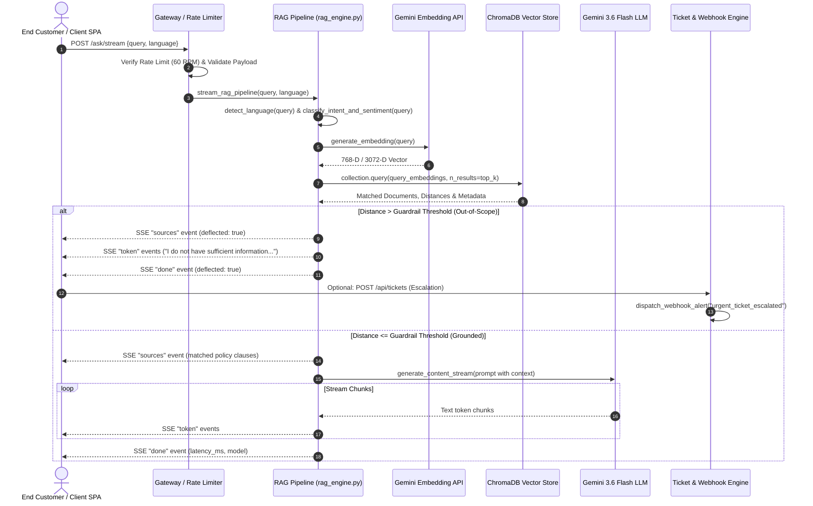

# OmniDesk AI — Technical Architecture Document

---

## 1. System Overview & Topology

OmniDesk AI is architected as a high-throughput, modular, policy-grounded RAG customer support platform. It integrates a **FastAPI** asynchronous backend, **ChromaDB** vector database, **Google Gemini 3.6 Flash / Embedding** models, and triple client interfaces (**Commercial Landing**, **Support Hub SPA**, and **Streamlit Command Center**).

```mermaid
flowchart TD
    subgraph ClientLayer["1. Client & Presentation Layer"]
        A1["Marketing Landing Page<br/>(index.html + js/landing.js)"]
        A2["Support Hub SPA Portal<br/>(app.html + js/app.js)"]
        A3["Streamlit Enterprise Center<br/>(app.py)"]
    end

    subgraph SecurityGateway["2. Security & Gateway Layer"]
        B1["CORS Middleware (FastAPI)"]
        B2["Sliding-Window Rate Limiter<br/>(60 RPM per IP)"]
        B3["Admin API Key Auth<br/>(X-API-Key / Bearer)"]
        B4["Pydantic v2 Request Validators"]
    end

    subgraph RAGCore["3. Core RAG & Intelligence Engine (rag_engine.py)"]
        C1["Language Detection & Localization<br/>(7 Languages)"]
        C2["Intent & Sentiment Classifier<br/>(7 Intents, 4 Sentiments)"]
        C3["Embedding Generator<br/>(gemini-embedding-001 / SHA256-D768 Fallback)"]
        C4["ChromaDB Vector Store<br/>(Cosine Space / Persistent)"]
        C5["Guardrail Deflection Gate<br/>(Distance <= 1.2)"]
        C6["LLM Synthesizer<br/>(Gemini 3.6 Flash / Grounded Fallback)"]
        C7["SSE Token Streamer<br/>(/ask/stream Generator)"]
    end

    subgraph BusinessOps["4. Support Operations & Copilot Engine (server.py)"]
        D1["Ticket Escalation Router<br/>(TCK-XXXX / CUST-XXXX)"]
        D2["AI Copilot Reply Generator<br/>(/suggest-reply)"]
        D3["Conversation Threading & Staff Notes<br/>(🔒 Internal Notes)"]
        D4["Dynamic SLA Engine<br/>(Urgent 1h, High 4h, Med 24h, Low 48h)"]
        D5["Macro Rules Engine<br/>(Variable Substitution)"]
    end

    subgraph TelemetryOps["5. Telemetry, Ops & Benchmarking"]
        E1["CSAT Telemetry & Analytics<br/>(/api/analytics)"]
        E2["Outbound Incident Webhooks<br/>(Slack / PagerDuty)"]
        E3["Autonomous Synthetic Benchmark Studio<br/>(QPS, P50/P90/P99 Latency)"]
        E4["CRM Data Export<br/>(CSV / JSON Streams)"]
    end

    ClientLayer --> SecurityGateway
    SecurityGateway --> RAGCore
    RAGCore --> BusinessOps
    BusinessOps --> TelemetryOps
```



---

## 2. Component Specifications

### 2.1 Client Layer

- **Support Hub SPA (`app.html` + `js/app.js`)**: Modern glassmorphic web portal featuring real-time SSE token rendering, citation drawers, interactive ticket escalation modals, AI Copilot drawer, CSAT rating widgets, and macro rule buttons.
- **Commercial Landing Page (`index.html` + `js/landing.js`)**: High-converting enterprise marketing portal with an interactive ROI calculator, live sandbox simulator, architecture visualizer, and feature deep-dives.
- **Streamlit Command Center (`app.py`)**: 4-Tab administrative control center providing live AI chat testing, ChromaDB vector management, ticket queue triaging, and real-time deflection telemetry.

### 2.2 Security & Gateway (`server.py`)

- **Sliding-Window Rate Limiter**: Implemented in Python using in-memory timestamp deques. Calculates rolling 60-second window consumption per client IP. Rejections emit `HTTP 429` with `Retry-After: <seconds>` headers.
- **Admin Auth Dependency (`verify_admin_key`)**: Protects mutating endpoints (`/api/kb/add`, `/api/kb/reset`, `/api/settings`, DELETE endpoints) via `X-API-Key` or `Authorization: Bearer <key>`. If `ADMIN_API_KEY` is not set in environment, defaults to developer mode.
- **Pydantic Validation Models**: Enforces strict typing, string length constraints (1–2,000 chars for queries, 1–20,000 chars for KB clauses), and sanitization.

### 2.3 RAG & Intelligence Engine (`rag_engine.py`)



#### Vector Ingestion Pipeline

1. **Source Document**: `knowledge_base/company_faq.txt`.
2. **Parser (`parse_faq_sections`)**: Identifies structured policy headings matching regex `\n(?=\d+\.\s+[A-Z\s,&/]+)` (e.g., *1. RETURN AND EXCHANGE POLICY*).
3. **Embedding Vectorization**: Computes embeddings via `gemini-embedding-001` with a deterministic SHA-256 L2-normalized 768-D vector fallback.
4. **Indexing**: Persistent ChromaDB storage using cosine similarity metrics (`hnsw:space: cosine`).

#### Zero-Hallucination Guardrail Gate

The system enforces strict cosine distance checks:
$$\text{Distance} = 1 - \cos(\vec{u}, \vec{v})$$

- If $\text{Distance} \le \text{Threshold}$ (default $1.2$): Query is considered **grounded in context** and sent to the LLM with strict system instructions:
  > *"Rely ONLY on the facts explicitly mentioned in the provided `<context>`. Do not extrapolate, assume, or fabricate any rules, dates, or prices."*
- If $\text{Distance} > \text{Threshold}$: Query is deflected without LLM fabrication.

---

## 3. Data Architecture & Storage Schemas

### 3.1 ChromaDB Collection Schema (`support_kb`)

- **Collection Name**: `support_kb`
- **Distance Metric**: Cosine (`hnsw:space: cosine`)
- **Document Payload**: Raw policy clause string.
- **Metadata Fields**:
  - `title`: String (e.g., `Section 1: Return and Exchange Policy`)
  - `source`: String (e.g., `company_faq.txt`)
  - `tokens`: Integer (estimated token length)
  - `chunk_id`: Integer / UUID

### 3.2 In-Memory & CRM Data Model (`TICKETS_DB`)

```json
{
  "id": "TCK-1042",
  "customer_id": "CUST-8492",
  "customer_name": "Elena Rostova",
  "customer_email": "elena.r@techcorp.io",
  "customer_tier": "VIP Enterprise",
  "intent": "Billing & Payment",
  "sentiment": "VIP / Commercial",
  "subject": "Custom enterprise bulk discount inquiry",
  "query": "We are looking to order 250 units for our corporate team...",
  "priority": "High",
  "status": "Open",
  "created_at": "Sep 21, 14:30",
  "created_ts": 1758450000.0,
  "assigned_agent": "Unassigned",
  "transcript_snippet": "Customer asked for bulk volume tier pricing...",
  "messages": [
    {
      "id": "msg_1",
      "sender": "Elena Rostova",
      "text": "We are looking to order 250 units...",
      "is_internal_note": false,
      "timestamp": "Sep 21, 14:30"
    },
    {
      "id": "msg_2",
      "sender": "Sarah Chen",
      "text": "Reviewing order volume against Enterprise discount table.",
      "is_internal_note": true,
      "timestamp": "Sep 21, 14:35"
    }
  ]
}
```

### 3.3 Dynamic SLA Calculation Algorithm

The SLA engine dynamically evaluates deadlines based on ticket creation timestamp and priority:

$$\text{Remaining Mins} = \text{Target Mins} - \left\lfloor \frac{\text{now}() - \text{created\_ts}}{60} \right\rfloor$$

| Priority Level | SLA Target Window | Warning Threshold | Breach Condition |
| :--- | :--- | :--- | :--- |
| **Urgent** | 60 minutes (1h) | $\le 30\text{ mins}$ | $\text{Remaining} \le 0\text{ mins}$ & Status $\ne$ Resolved |
| **High** | 240 minutes (4h) | $\le 60\text{ mins}$ | $\text{Remaining} \le 0\text{ mins}$ & Status $\ne$ Resolved |
| **Medium** | 1,440 minutes (24h) | $\le 180\text{ mins}$ | $\text{Remaining} \le 0\text{ mins}$ & Status $\ne$ Resolved |
| **Low** | 2,880 minutes (48h) | $\le 360\text{ mins}$ | $\text{Remaining} \le 0\text{ mins}$ & Status $\ne$ Resolved |

---

## 4. API Endpoints Catalog

| Method | Route | Description | Auth Required |
| :--- | :--- | :--- | :--- |
| `GET` | `/health` | System health check, vector counts, LLM mode | Public |
| `GET` | `/api/info` | API runtime parameters, uptime, rate limit settings | Public |
| `POST` | `/ask` | Synchronous grounded RAG query resolution | Public (Rate Limited) |
| `POST` | `/ask/stream` | Real-time Server-Sent Events (SSE) token stream | Public (Rate Limited) |
| `GET` | `/api/tickets` | List, search, and filter support tickets | Public |
| `POST` | `/api/tickets` | Create support escalation ticket + CUST ID routing | Public |
| `GET` | `/api/tickets/{id}` | Retrieve ticket details with live SLA badges | Public |
| `POST` | `/api/tickets/{id}/suggest-reply` | AI Copilot grounded reply generator | Public |
| `POST` | `/api/tickets/{id}/messages` | Append message or private staff note | Public |
| `PATCH` | `/api/tickets/{id}` | Update status, assigned agent, or priority | Public |
| `DELETE` | `/api/tickets/{id}` | Delete ticket from system | **Admin API Key** |
| `POST` | `/api/tickets/{id}/apply-macro` | Apply macro with dynamic variable substitution | Public |
| `GET` | `/api/tickets/export` | CRM Export stream (CSV / JSON) | Public |
| `GET` | `/api/kb/chunks` | List all indexed vector chunks | Public |
| `POST` | `/api/kb/add` | Vectorize and ingest new policy clause | **Admin API Key** |
| `DELETE` | `/api/kb/chunks/{id}` | Delete specific chunk from vector store | **Admin API Key** |
| `POST` | `/api/kb/reset` | Purge and re-index default knowledge base | **Admin API Key** |
| `GET` | `/api/kb/export` | Export knowledge base backup as JSON | Public |
| `GET` | `/api/settings` | Retrieve active RAG hyperparameters | Public |
| `POST` | `/api/settings` | Update threshold, top-k, model settings | **Admin API Key** |
| `POST` | `/api/feedback` | Submit CSAT feedback rating (1–5) | Public |
| `GET` | `/api/analytics` | Retrieve deflection rates, CSAT, audit logs | Public |
| `GET` | `/api/macros` | List pre-configured response macros | Public |
| `POST` | `/api/webhooks/test` | Trigger simulated incident webhook alert | Public |
| `GET` | `/api/webhooks/logs` | Retrieve outbound webhook dispatch logs | Public |
| `POST` | `/api/benchmark/simulate` | Run synthetic load & accuracy benchmark | Public |

---

## 5. Deployment & Runtime Architecture

- **ASGI Web Server**: Uvicorn running FastAPI application on `0.0.0.0:8000`.
- **Process Orchestration**: Procfile configured for cloud PaaS (Railway, Render, Fly.io):

  ```text
  web: uvicorn main:app --host 0.0.0.0 --port $PORT
  ```

- **Buildpack**: Nixpacks / Dockerfile configured via `nixpacks.toml` with Python 3.11+ runtime.
- **Environment Management**: Dual `.env` and `doc/.env` loading via `python-dotenv`.
