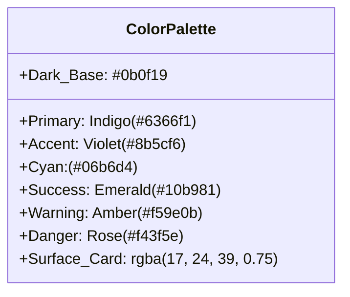

# OmniDesk AI — UI/UX Design System & Specification

---

## 1. Design Philosophy & Aesthetic Identity

OmniDesk AI embodies a **Cyber-Enterprise Glassmorphic** design aesthetic. It combines the sleek, futuristic feel of dark mode developer tools with the clarity and rigor required by enterprise customer support teams.

### Core Principles

1. **Clarity Over Clutter**: High-density operational data (SLAs, timestamps, vector distances) presented with clean typographic hierarchy and subtle contrast.
2. **Glassmorphism & Depth**: Multi-layered surfaces utilizing subtle translucent fills, semi-transparent borders, and `backdrop-filter: blur()` to establish visual elevation.
3. **Micro-Interactions & State Feedback**: Real-time SSE token typewriter effects, pulsing SLA warning badges, smooth drawer transitions, and interactive CSAT telemetry buttons.

---

## 2. Design Tokens & Color Palette



### 2.1 Color Tokens

| Token Name | Hex / RGBA Value | Semantic Usage |
| :--- | :--- | :--- |
| `--bg-base` | `#0b0f19` | Application base background |
| `--bg-surface` | `#111827` | Solid card and modal container backgrounds |
| `--bg-glass` | `rgba(17, 24, 39, 0.65)` | Glassmorphic floating cards and headers |
| `--border-subtle` | `rgba(255, 255, 255, 0.08)` | Default card and divider borders |
| `--border-glow` | `rgba(99, 102, 241, 0.35)` | Focused inputs and highlighted active cards |
| `--brand-primary` | `#6366f1` *(Indigo 500)* | Primary buttons, active tabs, brand accents |
| `--brand-accent` | `#8b5cf6` *(Violet 500)* | Gradient overlays, secondary actions |
| `--accent-cyan` | `#06b6d4` *(Cyan 500)* | Citation tags, intent pills, active streams |
| `--state-success` | `#10b981` *(Emerald 500)* | Resolved status, CSAT positive, online indicator |
| `--state-warning` | `#f59e0b` *(Amber 500)* | SLA warnings, VIP badges, internal staff notes |
| `--state-danger` | `#f43f5e` *(Rose 500)* | Urgent priority, SLA breached, error alerts |
| `--text-primary` | `#f8fafc` *(Slate 50)* | Primary headlines, customer chat text |
| `--text-muted` | `#94a3b8` *(Slate 400)* | Metadata, timestamps, SLA elapsed counters |

### 2.2 Typography Hierarchy

- **Font Families**:
  - Primary UI: `'Inter'`, `'Plus Jakarta Sans'`, `-apple-system`, `sans-serif`
  - Code & Telemetry: `'JetBrains Mono'`, `'Fira Code'`, `monospace`
- **Scale**:
  - `Display / Hero`: `2.25rem` (36px), Weight `800`, Line-height `1.2`
  - `Section Header (H2)`: `1.5rem` (24px), Weight `700`
  - `Card Header (H3)`: `1.125rem` (18px), Weight `600`
  - `Body Standard`: `0.9375rem` (15px), Weight `400`, Line-height `1.5`
  - `Badge / Pill / Code`: `0.75rem` (12px), Weight `600`, Uppercase tracking `0.05em`

### 2.3 Elevation & Blur Matrix

- **Glass Panel**: `backdrop-filter: blur(16px); background: rgba(17, 24, 39, 0.70); border: 1px solid rgba(255, 255, 255, 0.08);`
- **Active Glow Elevation**: `box-shadow: 0 8px 32px 0 rgba(99, 102, 241, 0.20);`
- **Modal Overlay**: `backdrop-filter: blur(8px); background: rgba(0, 0, 0, 0.65);`

---

## 3. Core Component Design Specifications

### 3.1 Live AI Chat Assistant (`app.html` / `app.py`)

- **User Bubble**: Right-aligned, dark indigo tint (`rgba(99, 102, 241, 0.15)`), rounded with subtle top-right notch (`border-radius: 16px 16px 4px 16px`).
- **Assistant Bubble**: Left-aligned, dark slate glass with subtle white border (`rgba(255, 255, 255, 0.08)`), rounded with top-left notch (`border-radius: 16px 16px 16px 4px`).
- **SSE Typewriter Cursor**: Blinking indigo bar (`2px` width, `animation: blink 1s infinite`) attached to active streaming tokens.
- **Citation Accordion**: Collapsible drawer beneath answers displaying policy section numbers, source file name, and cosine distance score (`dist: 0.28`).

### 3.2 Dynamic SLA Countdown Badges

| Badge Status | Visual Styling | Trigger Condition |
| :--- | :--- | :--- |
| **Normal** | Blue/Slate pill (`#38bdf8`) | Remaining SLA time $> 3\text{ hours}$ |
| **Warning** | Amber glowing pill (`#fbbf24`) with pulse | Remaining SLA time $\le 3\text{ hours}$ |
| **Urgent** | Rose glowing pill (`#fb7185`) with fast pulse | Remaining SLA time $\le 60\text{ mins}$ |
| **Breached** | Deep crimson badge (`#e11d48`) with hazard icon | Remaining SLA $\le 0\text{ mins}$ & status $\ne$ Resolved |
| **Resolved** | Emerald pill (`#34d399`) with checkmark | Ticket status $=$ `Resolved` |

### 3.3 Ticket Queue & Copilot Drawer

- **Ticket Card Layout**:
  - Top row: Ticket ID (`TCK-1042`), Customer ID (`CUST-8492`), VIP Tier Badge, Priority Pill, SLA Badge.
  - Middle: Subject line, snippet preview, intent pill.
  - Bottom row: Assigned agent, relative timestamp, "Open Copilot" action button.
- **AI Copilot Drawer**:
  - Right-sliding drawer (`420px` width) containing customer profile overview, grounded AI reply generator (`/suggest-reply`), Quick Macro insertion buttons, and internal staff note toggle (`🔒 Staff Note`).

### 3.4 Internal Staff Notes (`🔒 Staff Note`)

- Styled with a warm amber background (`rgba(245, 158, 11, 0.10)`) and amber dashed border (`rgba(245, 158, 11, 0.35)`).
- Clear header indicator: `🔒 Private Internal Staff Note (Confidential)`.
- Kept strictly distinct from public customer-facing responses.

### 3.5 Quick Macro Buttons & Template Picker

- Macro buttons featured in the Copilot toolbar:
  - `📦 30-Day RMA`
  - `🛡️ 1-Yr Warranty`
  - `💳 Price Match`
  - `✈️ DHL DDP`
- Clicking a macro instantly resolves dynamic placeholders (`{{customer_name}}`, `{{ticket_id}}`, `{{assigned_agent}}`) and populates the response draft.

---

## 4. Responsive Layout Breakpoints

```text
+-------------------------------------------------------------------+
| Large Desktop (>= 1200px): 3-Column Layout                        |
| [ Left Nav / KPIs (250px) | Main Queue (1fr) | Copilot (420px) ]  |
+-------------------------------------------------------------------+
| Tablet (768px - 1199px): 2-Column with Overlay Drawer              |
| [ Collapsed Nav (64px)   | Main View (1fr)  ] [ Sliding Copilot ] |
+-------------------------------------------------------------------+
| Mobile (< 768px): Single Column Stacked with Tab Navigation       |
| [ Header ] -> [ Active Tab Content (100%) ] -> [ Bottom Nav Bar ] |
+-------------------------------------------------------------------+
```

---

## 5. Micro-Animations & Motion Design

- **Streaming Token Fade-In**: Keyframe transition from `opacity: 0; transform: translateY(2px)` to `opacity: 1; transform: translateY(0)` at `80ms`.
- **Drawer Slide**: `transition: transform 0.3s cubic-bezier(0.16, 1, 0.3, 1);`
- **Button Hover Glow**: `transition: all 0.2s ease; box-shadow: 0 0 15px rgba(99, 102, 241, 0.4);`
- **SLA Urgent Pulse**:

  ```css
  @keyframes slaPulse {
    0%, 100% { transform: scale(1); opacity: 1; }
    50% { transform: scale(1.05); opacity: 0.85; }
  }
  ```
