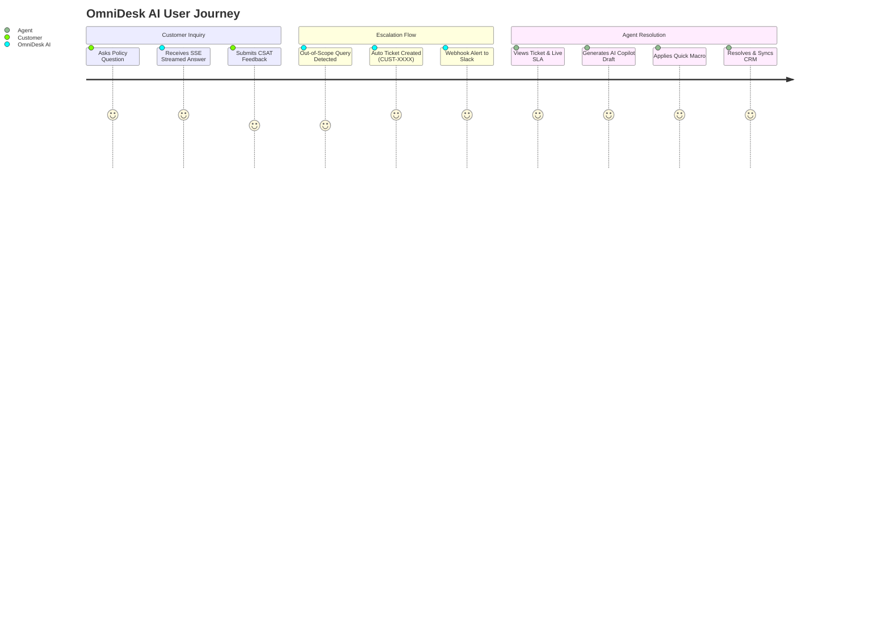

# OmniDesk AI — Product Requirements Document (PRD)

---

## 1. Executive Summary

**OmniDesk AI** is an enterprise-grade, zero-hallucination customer support automation and escalation platform. Powered by Google Gemini 3.6 Flash, dense vector embeddings (`gemini-embedding-001`), ChromaDB vector store, FastAPI backend, Support Hub Single Page Application (SPA), and Streamlit Command Center, OmniDesk AI delivers sub-second, verified customer support resolutions strictly grounded in company policy documents.

Unlike conventional conversational chatbots that hallucinate terms, policies, or pricing, OmniDesk AI enforces deterministic vector guardrails. When an inquiry falls outside verified policy documents, the platform automatically deflects the query, assigns a unique Customer ID (`CUST-XXXX`), generates a structured support ticket (`TCK-XXXX`), and routes it to human support specialists with AI-drafted copilot suggestions and live SLA countdown telemetry.

---

## 2. Problem Statement & Market Need

Modern e-commerce and SaaS enterprises face three critical customer service bottlenecks:

1. **Hallucination Risk & Compliance Liability**: Generic LLM assistants frequently invent return windows, shipping discounts, or warranty exceptions, costing businesses thousands of dollars in dispute resolutions.
2. **High Escalation & Support Costs**: Repetitive Tier 1 inquiries (e.g., return policies, customs duties, order modification windows) consume 70–80% of live agent bandwidth, slowing down response times for urgent VIP and high-value issues.
3. **Fragmented Agent Tooling**: Human support agents lack unified context, having to manually search documentation, calculate SLA breach windows, draft standard replies from scratch, and synchronize ticket statuses across disparate CRM tools.

---

## 3. Product Vision & Value Proposition

- **100% Policy Grounding**: Sub-second answers strictly verified against enterprise knowledge bases with transparent citation expanders and vector distance metrics.
- **Automated Deflection & Triaging**: 85%+ automated deflection of repetitive inquiries, auto-classifying intent (e.g., Return & Refund, Shipping & Logistics, Warranty & Claims, Billing & Payment, Order Modification) and sentiment urgency.
- **Augmented Human Copilot**: Empowers Tier 2 support agents with 1-click policy-grounded draft generation, private internal staff notes, automated macro rule substitutions, and live SLA countdown timers.
- **Multilingual Global Reach**: Automatic detection and localized policy resolution across 7 major world languages (English, Spanish, French, German, Japanese, Portuguese, Hindi).

---

## 4. User Personas & Target Audience

| Persona | Role | Primary Goals & Jobs to be Done | Key Pain Points |
| :--- | :--- | :--- | :--- |
| **End Customer** *(Retail & VIP)* | Shopper / Subscriber | Fast, accurate answers about returns, international shipping, warranty claims, and order modifications. | Unhelpful generic bots, long queue times, ambiguous policies. |
| **Support Specialist** *(Tier 1/2)* | Customer Support Agent | Efficiently review escalated tickets, apply pre-approved macros, view grounded AI reply drafts, and add internal staff notes. | Repetitive typing, context switching across systems, missing customer history. |
| **Support Lead / Ops Manager** | Support Team Manager | Monitor team SLAs, review deflection rates, track live CSAT scores, export CRM audit logs, and trigger incident webhooks. | Unmonitored SLA breaches, lack of real-time operational visibility. |
| **Knowledge Base Admin** | Policy / Ops Admin | Update store policy clauses, vectorize new FAQs into ChromaDB, adjust distance guardrails, and run synthetic benchmarks. | Outdated documentation, complex vector database maintenance. |

---

## 5. Scope & 7-Phase Feature Requirements

### 5.1 Phase 1: Core Grounded RAG & Real-Time SSE Token Streaming

- **Vector Ingestion**: Automatically parse, chunk, and index store policy documents (`company_faq.txt`) into ChromaDB using cosine distance space.
- **Server-Sent Events (SSE)**: Dedicated `/ask/stream` endpoint yielding real-time token stream chunks with sub-second time-to-first-token (TTFT).
- **Citation Metadata**: Every answer must return matched source clauses, section numbers, token counts, and vector distance scores.
- **Distance Guardrails**: Queries with cosine distance exceeding the configured threshold (default: `1.2`) are automatically flagged as `deflected: true`.

### 5.2 Phase 2: Production Hardening & Security Gateway

- **Sliding-Window Rate Limiter**: 60 requests/minute per client IP, returning `HTTP 429 Too Many Requests` with `Retry-After` headers.
- **Admin Authentication**: Sensitive management endpoints guarded via `X-API-Key` or `Authorization: Bearer <token>`.
- **Input Validation**: Pydantic v2 validation enforcing non-empty queries and a 2,000-character payload ceiling (`HTTP 422`).
- **Telemetry & Health**: Endpoints for `/health` and `/api/info` exposing server uptime, vector count, and security configurations.

### 5.3 Phase 3: Smart Escalation & Customer ID Routing

- **Automated Ticket Creation**: Out-of-scope or manual escalations generate `TCK-XXXX` tickets and assign permanent `CUST-XXXX` identifiers.
- **Customer Tier Triage**: Support for `VIP Enterprise`, `Pro Business`, and `Standard Retail` customer tiers.
- **Ticket Lifecycle**: Full state machine supporting `Open` $\to$ `In Progress` $\to$ `Resolved`.
- **Filtering & Search**: Real-time filtering by status (`Open`, `In Progress`, `Resolved`), priority (`Urgent`, `High`, `Medium`, `Low`), and free text.

### 5.4 Phase 4: Intent/Sentiment Classification & CRM Export

- **Automated Intent Tagging**: Multi-channel classifier tagging queries into:
  - `Return & Refund`
  - `Shipping & Logistics`
  - `Warranty & Claims`
  - `Billing & Payment`
  - `Order Modification`
  - `Account & Security`
  - `General Inquiry`
- **Sentiment & Urgency Classification**: Identifies `High Urgency`, `VIP / Commercial`, `Standard`, and `Positive Inquiry`.
- **CRM Data Streams**: 1-click export of complete ticket histories to CSV and JSON formats.
- **Streamlit Command Center**: 4-tab dashboard for operational control and live monitoring.

### 5.5 Phase 5: AI Agent Copilot & Live SLA Countdown Engine

- **AI Reply Draft Generator (`/api/tickets/{id}/suggest-reply`)**: Grounded synthesizer generating personalized resolution emails referencing official store policies and customer tier.
- **Conversation Threading & Internal Staff Notes**: Chronological thread of customer interactions alongside private, amber-locked internal notes (`🔒 Staff Note`).
- **Live SLA Countdown Badges**: Dynamic SLA countdown calculation:
  - `Urgent`: 60 minutes (1h)
  - `High`: 240 minutes (4h)
  - `Medium`: 1,440 minutes (24h)
  - `Low`: 2,880 minutes (48h)
  - Visual breach alerts when deadline expires.

### 5.6 Phase 6: Multi-Language Auto-Localization, CSAT & Quick Macros

- **7-Language Localization**: Automatic language detection and localized policy responses for English, Spanish, French, German, Japanese, Portuguese, and Hindi.
- **CSAT Feedback Telemetry**: Direct `👍 Helpful` and `👎 Needs Work` ratings with 1–5 score telemetry and live CSAT calculation (`/api/analytics`).
- **Quick Response Macros**: Pre-configured response templates with dynamic variable replacement (`{{customer_name}}`, `{{ticket_id}}`, `{{assigned_agent}}`):
  - `📦 30-Day Return RMA Authorization`
  - `🛡️ 1-Year Manufacturer Warranty Intake`
  - `💳 14-Day Price Match Adjustment Credit`
  - `✈️ DHL International DDP Delivery Details`

### 5.7 Phase 7: Autonomous Synthetic Benchmarking & Incident Webhooks

- **Autonomous Benchmark Studio (`/api/benchmark/simulate`)**: Synthetic load and accuracy benchmark measuring QPS throughput, latency percentiles (P50, P90, P99), deflection accuracy, and intent classification precision.
- **Outbound Incident Webhook Dispatcher**: Automatic incident dispatching to external channels (e.g. Slack `#support-alerts`, PagerDuty) on urgent VIP tickets or low CSAT ratings ($\le 2/5$).
- **Unified Master Test Suite (`test_master_suite.py`)**: Single-command test runner verifying all 7 phases with an automated executive scorecard.

---

## 6. Non-Functional Requirements (NFRs)

| Attribute | Specification | Measurement Method |
| :--- | :--- | :--- |
| **Response Latency** | $\le 500\text{ ms}$ TTFT on streamed queries; $\le 800\text{ ms}$ for full REST generation. | Server-side latency tracking & benchmark telemetry. |
| **Availability & Uptime** | 99.9% uptime with automatic local grounded fallback if LLM API is unavailable. | Health check monitoring (`/health`). |
| **Zero-Hallucination Rate** | 100% compliance with store policies in context; strict fallback for out-of-context queries. | Synthetic benchmark guardrail accuracy ($\ge 95\%$). |
| **Security & Auth** | Rate limiting at 60 RPM; header-based `X-API-Key` authentication for admin endpoints. | Automated security regression test suite. |
| **Browser Compatibility** | Chrome, Edge, Safari, Firefox modern evergreen browsers; responsive on mobile & tablet. | Client SPA responsive testing. |

---

## 7. Key Performance Indicators (KPIs)

- **First-Contact Resolution (FCR)**: $\ge 85\%$ of standard inquiries resolved without human intervention.
- **Deflection Rate**: Target $80\text{--}90\%$ deflection on repetitive Tier 1 store policy topics.
- **Customer Satisfaction (CSAT)**: Average CSAT rating $\ge 4.8 / 5.0$.
- **Average Handle Time (AHT)**: Human agent handle time reduced by $65\%$ using AI Copilot drafts and Quick Macros.
- **SLA Breach Rate**: Less than $1.5\%$ of tickets breaching designated SLA target windows.

---

## 8. Risk Management & Mitigations

| Risk | Impact | Likelihood | Mitigation Strategy |
| :--- | :--- | :--- | :--- |
| **LLM API Outage / Rate Limit** | High | Medium | Deterministic local grounded fallback engine activates automatically. |
| **Policy Desynchronization** | High | Low | Dynamic Knowledge Base Studio allows 1-click re-indexing and JSON backup. |
| **Malicious / Abuse Queries** | Medium | Medium | Sliding-window rate limiter (60 RPM) and 2,000-char input validation guards. |
| **SLA Overdue on Urgent Tickets** | High | Low | Real-time SLA countdown badges and automated Slack webhook incident dispatching. |
