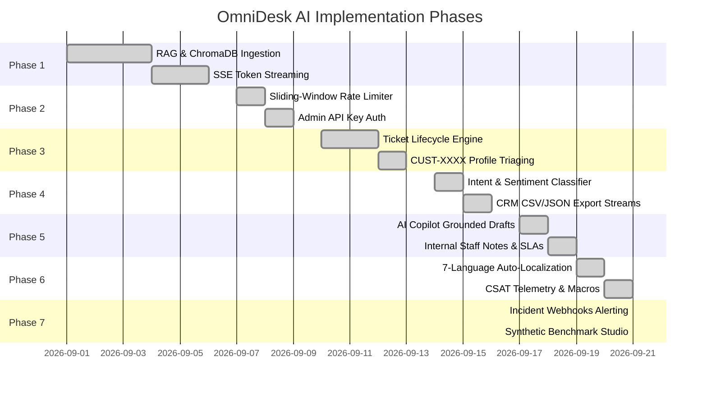

# OmniDesk AI — Project Implementation Tasks & Roadmap

---

## 1. Executive Implementation Tracker (Phases 1 — 7)

---

## 2. Phase-by-Phase Task Checklist

### Phase 1: Core Grounded RAG & Real-Time SSE Token Streaming

- [x] Create enterprise store policy knowledge base in `knowledge_base/company_faq.txt`.
- [x] Build structured section parser (`parse_faq_sections`) in `rag_engine.py`.
- [x] Configure persistent ChromaDB vector store with cosine distance metric.
- [x] Implement Google Gemini dense embedding integration (`gemini-embedding-001`) with deterministic fallback.
- [x] Implement synchronous `/ask` RAG query endpoint.
- [x] Build Server-Sent Events (SSE) generator (`/ask/stream`) for streaming token delivery.
- [x] Implement vector distance guardrail gate (distance threshold: 1.2).
- [x] Create automated integration test: `test_rag_integration.py`.

### Phase 2: Production Hardening, Security & Gateway

- [x] Build sliding-window rate limiter class (`SlidingWindowRateLimiter`) with 60 RPM limit.
- [x] Add `HTTP 429 Too Many Requests` response with `Retry-After` header.
- [x] Implement header-based Admin API Key authorization (`X-API-Key` & `Bearer`).
- [x] Add Pydantic v2 input validation models with length constraints and empty check guards (`HTTP 422`).
- [x] Add system health and telemetry diagnostics endpoints (`/health`, `/api/info`).
- [x] Create automated hardening test: `test_production_hardening.py`.

### Phase 3: Smart Escalation & Customer ID Routing

- [x] Create in-memory tickets database (`TICKETS_DB`) with lifecycle states (`Open`, `In Progress`, `Resolved`).
- [x] Build automatic Customer ID assignment (`CUST-XXXX`) and Ticket ID generator (`TCK-XXXX`).
- [x] Implement VIP tier triage (`VIP Enterprise`, `Pro Business`, `Standard Retail`).
- [x] Build REST endpoints: `GET /api/tickets`, `POST /api/tickets`, `PATCH /api/tickets/{id}`, `DELETE /api/tickets/{id}`.
- [x] Create automated escalation test: `test_ticket_escalation.py`.

### Phase 4: Multi-Channel Intent Classification & CRM Export

- [x] Build heuristic intent classifier (`classify_intent_and_sentiment`) covering 7 core intents.
- [x] Implement sentiment and urgency detection (`High Urgency`, `VIP / Commercial`, `Standard`, `Positive`).
- [x] Build 1-click CRM export streams for CSV and JSON (`/api/tickets/export`).
- [x] Build 4-Tab Streamlit enterprise control center (`app.py`).
- [x] Create automated intent test: `test_phase4_features.py`.

### Phase 5: AI Agent Copilot & Live SLA Countdown Engine

- [x] Build AI Copilot reply generator (`generate_agent_reply_draft` / `/api/tickets/{id}/suggest-reply`).
- [x] Implement chronological message threading and private internal staff notes (`is_internal_note: true`).
- [x] Implement dynamic SLA calculation algorithm (`calculate_sla_details`) across 4 priority levels.
- [x] Integrate live SLA countdown pills in Support Hub SPA and Streamlit dashboard.
- [x] Create automated copilot test: `test_phase5_copilot.py`.

### Phase 6: Multi-Language Auto-Localization, CSAT & Quick Macros

- [x] Build automatic language detection engine (`detect_language`) supporting 7 languages.
- [x] Implement localized dictionary fallback translations (`LOCAL_TRANSLATIONS`).
- [x] Build CSAT feedback telemetry endpoint (`POST /api/feedback`) and live CSAT scoring (`/api/analytics`).
- [x] Create Quick Response Macros engine (`MACROS_DB` and `/api/tickets/{id}/apply-macro`) with variable substitution.
- [x] Create automated localization test: `test_phase6_features.py`.

### Phase 7: Autonomous Synthetic Benchmarking & Incident Webhooks

- [x] Build autonomous synthetic benchmark studio (`run_synthetic_benchmark` / `/api/benchmark/simulate`).
- [x] Calculate benchmark telemetry: QPS throughput, Latency percentiles (P50, P90, P99), Guardrail accuracy.
- [x] Build outbound incident webhook dispatcher (`dispatch_webhook_alert` / `/api/webhooks/test`).
- [x] Trigger automated webhook dispatches for Urgent VIP tickets, SLA warnings (<30m), and low CSAT ratings ($\le 2/5$).
- [x] Consolidate all 7 phases into single unified master test suite (`test_master_suite.py`).

### Phase 8: Hybrid Search & Multi-Modal Vision RAG (Completed)

- [x] Build BM25 sparse keyword ranking engine (`bm25_search`) for exact terminology matches.
- [x] Implement Reciprocal Rank Fusion (`hybrid_search_rag`) combining ChromaDB dense vectors and BM25 scores (`POST /api/search/hybrid`).
- [x] Build Multi-Modal Vision Claim Analyzer (`analyze_claim_image` / `POST /api/vision/analyze-claim`) grounded in Section 4 warranty rules.
- [x] Create GitHub Actions CI/CD regression workflow (`.github/workflows/ci.yml`).
- [x] Create dedicated test suite `test_phase8_features.py` and integrate into `test_master_suite.py`.

---

## 3. Future Roadmap & Upcoming Enhancements (Phase 9+)

| Milestone | Target Feature | Description | Priority |
| :--- | :--- | :--- | :--- |
| **9.1** | **Live Voice Support Agent** | Real-time WebRTC audio streaming grounded in store policies using Gemini Live API. | High |
| **9.2** | **Zendesk & Salesforce CRM Sync** | Bi-directional webhook synchronization with enterprise CRM platforms. | High |
| **9.3** | **Automated Policy Drift Alerts** | Automated vector similarity scans detecting conflicting clauses across uploaded policy files. | Low |
